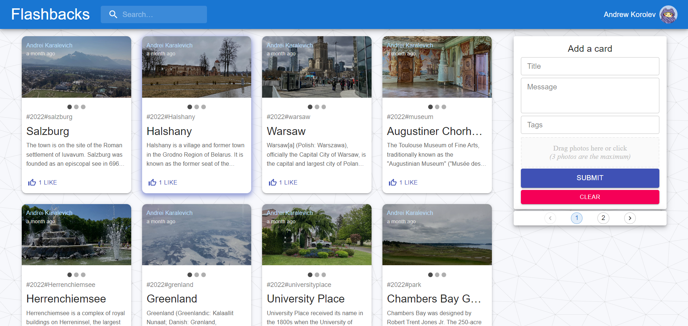

# Flashbacks

Deploy: https://flashb.netlify.app

##Description

This application is created by using the MERN stack. You need to sign up before adding, deleting, liking, commenting, update posts. 

In the project directory, you can run:

#### `cd client` && `npm run instal --force && npm start`
#### `cd server` && `npm run instal npm start`

Open [http://localhost:3000](http://localhost:3000) to view it in the browser.

The page will reload if you make edits.

